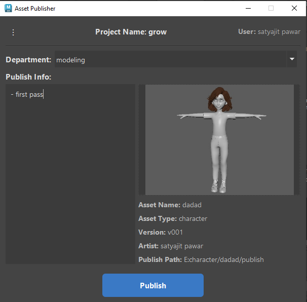
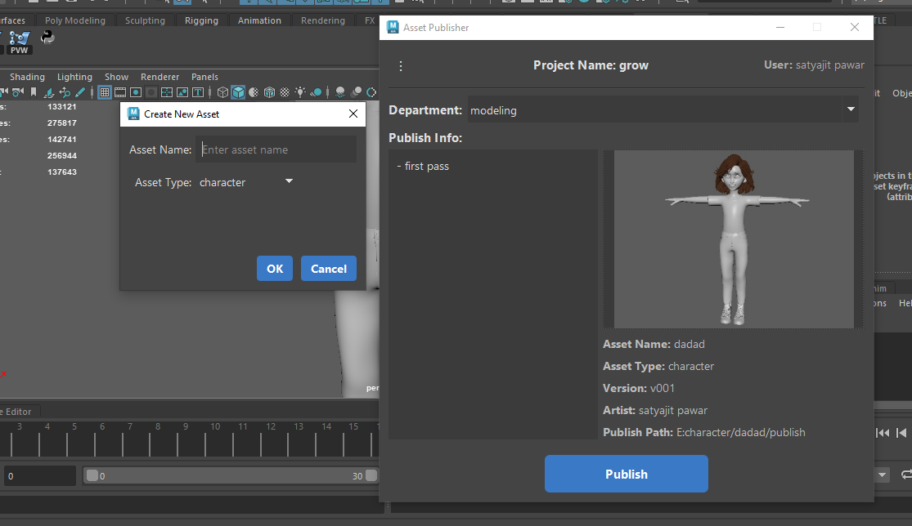

# 📦 Maya Asset Publisher Tool

A custom asset publishing tool for Autodesk Maya, built with PySide2.  
Supports asset creation, metadata handling, versioned publishing, preview image capture, and publishing history tracking.

---

---

✅ Features
🔹 Asset creation dialog

🔹 Project-based config system

🔹 Department-aware versioning

🔹 Viewport preview capture (playblast)

🔹 JSON metadata handling and history

🔹 UI auto-fills asset data if metadata exists

🔹 Metadata auto-creation and update on publish

🔹 Automatically manages folders and versions

🔹 Saves preview images per version

🔹 Tracks user info using system login

## 📁 Folder Structure

```
pip_dev/
├── asset_maneger/
│ └── publish_tool/
│ ├── asset_maneger_ui.py
│ └── [core modules...]
├── sources/
│ └── pip_dev/
│ └── scripts/
│ └── userSetup.py
├── modules/
│ └── pip_dev.mod
└── start_maya.bat
```

---

## 🚀 Setup Instructions

### Step 1: Place the Folder

Place the entire `pip_dev` folder anywhere (e.g., `D:/pip_dev`, `E:/tools/pip_dev`, etc.).

---

### Step 2: Configure Maya Environment

Edit or create the following file:

`C:/Users/<your_username>/Documents/maya/2023/Maya.env`

Add this line at the end:

```
MAYA_MODULE_PATH=<path_to_your>/pip_dev/modules
```

✅ Example:
```
MAYA_MODULE_PATH=D:/pip_dev/modules
```

> 💡 Update this path if you move the folder to a different location.

---

### Step 3: `pip_dev.mod` File

Located at:

[`pip_dev/modules/pip_dev.mod`](modules/pip_dev.mod)

Content:
```
MAYAVERSION:2023 PLATFORM:win64 pip_dev 0.0.1 ../..
scripts: ../sources/pip_dev/scripts
```

---

### Step 4: `userSetup.py`

Located at:

[`pip_dev/sources/pip_dev/scripts/userSetup.py`](sources/pip_dev/scripts/userSetup.py)

Make sure it properly appends your module path to `sys.path` at Maya startup.

---
### Step 5: Configure Project Settings

Edit the [`asset_maneger/project_config.py`](asset_maneger/project_config.py) file to set your project name and the root path where your project assets will be stored or published.

Update the `CONFIG_DATA` dictionary with your specific project details.

```python
# project_config.py

CONFIG_DATA = {
    "project_name": "grow", # Replace with your project's name
    "project_path": r"E:" # Replace with the root directory for your project assets
}
```

## 🖥️ Launching the Tool

### step 1:  Use start_maya.bat

Use the included .bat file to launch Maya with module support. This batch file is configured to work with Maya 2020 and later versions by dynamically setting the `MAYA_MODULE_PATH`. This is crucial for ensuring the tool's modules are correctly loaded into Maya's environment, preventing potential errors.

```bat
@echo off
SET MAYA_MODULE_PATH=%MAYA_MODULE_PATH%;%~dp0modules
START "" "C:\\Program Files\\Autodesk\\Maya[VERSION_YEAR]\\bin\\maya.exe"
```
Replace `[VERSION_YEAR]` with your Maya version (e.g., 2020, 2023, etc.).

# step 2: use this code in maya script editor

```python
import importlib
import publish_tool.asset_maneger_ui as asset_maneger_ui
importlib.reload(asset_maneger_ui)
asset_maneger_ui.show()
```


> The main UI for asset publishing, with metadata display and preview capture.



> This shows the 'Create New Asset' popup with asset type and name inputs.

🧠 Internal Logic Highlights
If no metadata exists, it creates metadata node and default JSON

Reads and displays current metadata from scene

Updates metadata and preview path on each publish

Stores publish history with timestamp, version, and comment

Uses login username to track artists and publishers

Supports dynamic folder structure creation per asset type/department

## 💻 Code Structure

The tool's codebase is structured to separate the user interface concerns from the core publishing logic for improved maintainability and organization.

- `AssetPublisherUI`: Handles the creation and management of the graphical user interface elements. It receives user input and displays information, delegating complex operations to the logic class.
- `AssetPublisherLogic`: Contains the core business logic for asset publishing, including metadata handling, versioning, file operations, and interactions with Maya's commands (like playblast). The UI class interacts with an instance of this class to perform actions.
🔧 Requirements
Autodesk Maya 2023

Python 3.9 (bundled with Maya)

PySide2 (comes with Maya)

📞 Support
For queries or feedback:
📧 sp5520873@gmail.com
🛠️ Or raise an issue on your GitHub repository.
